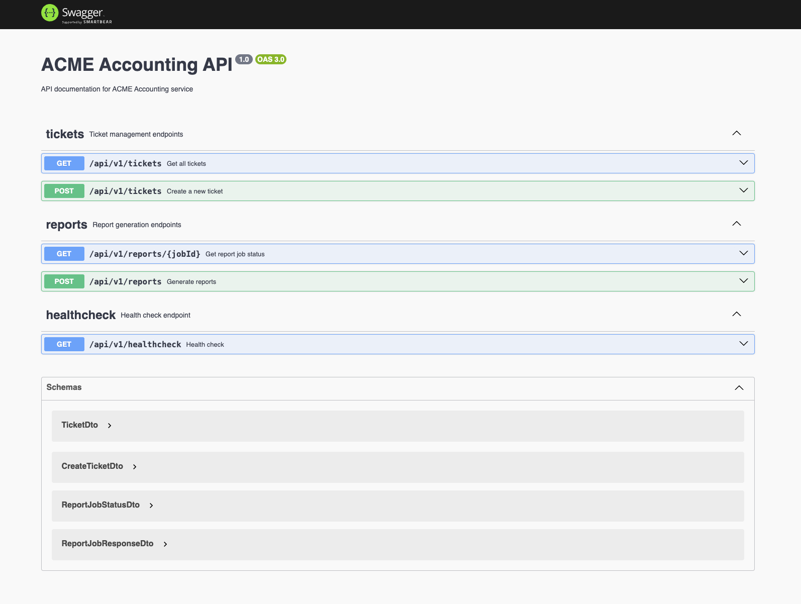

# ACME Accounting

A modern accounting and company management system built with NestJS, PostgreSQL, and Redis.

## Overview

ACME Accounting is a comprehensive solution for managing company tickets, users, and generating financial reports. The system handles various accounting and corporate operations through a ticket-based workflow system.

## Features

- **Ticket Management**: Create and track different types of tickets (Management Reports, Registration Address Changes, Strike-Off)
- **User Role Management**: Support for different user roles (Accountant, Corporate Secretary, Director)
- **Company Management**: Track companies and their associated users
- **Report Generation**: Generate financial reports asynchronously with Bull queue processing
- **API Documentation**: Swagger UI for easy API exploration

## Architecture

- **Backend**: NestJS framework with TypeScript
- **Database**: PostgreSQL with Sequelize ORM
- **Job Queue**: Bull with Redis for background processing
- **Testing**: Jest for unit and integration testing

## Getting Started

### Prerequisites

- Node.js (version specified in .nvmrc)
- Docker and Docker Compose
- PostgreSQL
- Redis

### Installation

1. Clone the repository

```sh
git clone https://github.com/DaiThanh97/osome-test.git
cd osome-test
```

2. Install dependencies

```sh
nvm use
npm install
```

3. Start the database and Redis

```sh
docker-compose up -d
```

4. Run migrations

```sh
npm run db:migrate
```

5. Start the server

```sh
npm start
```

**NOTE**: Update `.env.example` to `.env` to bootstrap correctly.

6. Access the API at http://localhost:3000/api/v1/healthcheck
7. Access API documentation at http://localhost:3000/api/v1/docs



### What I have completed

## Completed Features

- **Core API Implementation**: Developed a RESTful API using NestJS with TypeScript for ticket management, user roles, and company operations.
- **Database Integration**: Implemented PostgreSQL with Sequelize ORM for data persistence with proper relationships between entities.
- **Asynchronous Processing**: Set up Bull queue with Redis for background processing of reports to improve system responsiveness.
- **Database Optimization**: Added strategic indexing on frequently queried columns to improve performance:
  - Single-column indexes on `type`, `status`, `companyId`, and `assigneeId` for tickets
  - Composite indexes for common query patterns like `(companyId, type, status)`
  - Role-based indexes for user queries
- **API Documentation**: Integrated Swagger UI for comprehensive API documentation and testing.
- **Data Validation**: Implemented robust input validation using class-validator and DTO patterns.
- **Error Handling**: Created consistent error handling mechanisms across the application.

## Areas for Improvement

- **Authentication & Authorization**: Implement JWT-based authentication and role-based access control.
- **Test Coverage**: Expand unit and integration test coverage beyond the current implementation.
- **Logging & Monitoring**: Add structured logging and monitoring solutions for production environments.
- **Caching Strategy**: Implement Redis caching for frequently accessed data to reduce database load.
- **CI/CD Pipeline**: Set up automated testing and deployment workflows.
- **Rate Limiting**: Add API rate limiting to prevent abuse and ensure system stability.
- **Data Pagination**: Implement cursor-based pagination for large data sets to improve performance.
- **Audit Logging**: Track changes to critical data for compliance and debugging purposes.
- **Containerization**: Improve Docker configuration for production deployment with proper resource limits.
- **Documentation**: Expand API documentation with more examples and use cases.
